# Architecture Documentation

## Table of Contents

- [System Overview](#system-overview)
- [High-Level Architecture](#high-level-architecture)
- [Component Diagram](#component-diagram)
- [Registration Flow](#registration-flow)
- [Authentication Flow](#authentication-flow)
- [Account Recovery Flow](#account-recovery-flow)
- [Passkey Management Flow](#passkey-management-flow)
- [Session Management](#session-management)
- [Package Structure](#package-structure)
- [Domain Model](#domain-model)
- [Database Schema](#database-schema)
- [Security Architecture](#security-architecture)

---

## System Overview

This WebAuthn authentication system implements the FIDO2/WebAuthn standard for passwordless authentication. The architecture follows Clean Architecture principles with a feature-based modular structure.

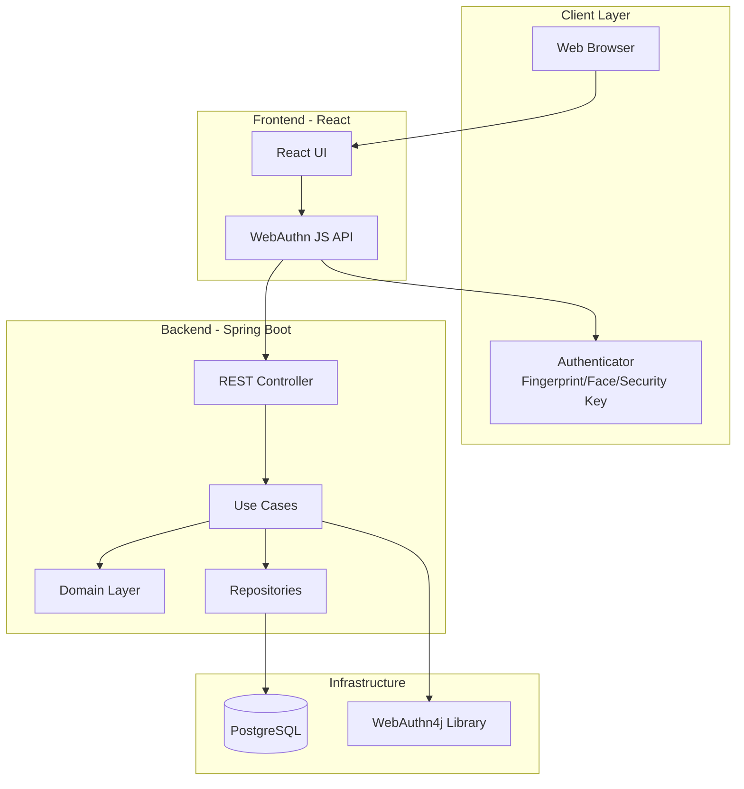
```mermaid
graph TB
    subgraph "Client Layer"
        Browser[Web Browser]
        Authenticator[Authenticator<br/>Fingerprint/Face/Security Key]
    end

    subgraph "Frontend - React"
        UI[React UI]
        WebAuthnJS[WebAuthn JS API]
    end

    subgraph "Backend - Spring Boot"
        Controller[REST Controller]
        UseCase[Use Cases]
        Domain[Domain Layer]
        Repository[Repositories]
    end

    subgraph "Infrastructure"
        DB[(PostgreSQL)]
        WebAuthn4j[WebAuthn4j Library]
    end

    Browser --> UI
    UI --> WebAuthnJS
    WebAuthnJS --> Authenticator
    WebAuthnJS --> Controller
    Controller --> UseCase
    UseCase --> Domain
    UseCase --> WebAuthn4j
    UseCase --> Repository
    Repository --> DB
```

---

## High-Level Architecture

The system uses **Hexagonal Architecture** (Ports & Adapters) combined with **Clean Architecture** principles.

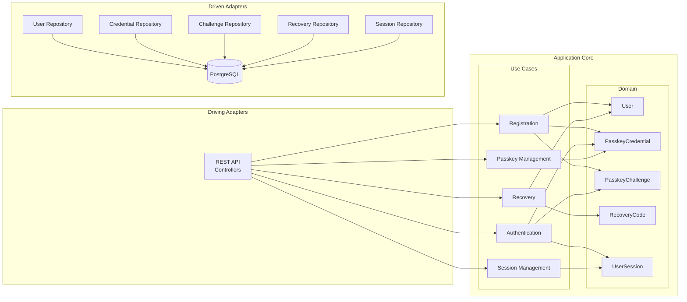
```mermaid
graph LR
    subgraph "Driving Adapters"
        REST[REST API<br/>Controllers]
    end

    subgraph "Application Core"
        subgraph "Use Cases"
            UC1[Registration]
            UC2[Authentication]
            UC3[Passkey Management]
            UC4[Recovery]
            UC5[Session Management]
        end

        subgraph "Domain"
            User[User]
            Credential[PasskeyCredential]
            Challenge[PasskeyChallenge]
            Recovery[RecoveryCode]
            Session[UserSession]
        end
    end

    subgraph "Driven Adapters"
        UserRepo[User Repository]
        CredRepo[Credential Repository]
        ChalRepo[Challenge Repository]
        RecoveryRepo[Recovery Repository]
        SessionRepo[Session Repository]
        DB[(PostgreSQL)]
    end

    REST --> UC1
    REST --> UC2
    REST --> UC3
    REST --> UC4
    REST --> UC5

    UC1 --> User
    UC1 --> Challenge
    UC1 --> Credential
    UC2 --> Challenge
    UC2 --> Credential
    UC2 --> Session
    UC3 --> Credential
    UC4 --> Recovery
    UC4 --> User
    UC5 --> Session

    UserRepo --> DB
    CredRepo --> DB
    ChalRepo --> DB
    RecoveryRepo --> DB
    SessionRepo --> DB
```

---

## Component Diagram

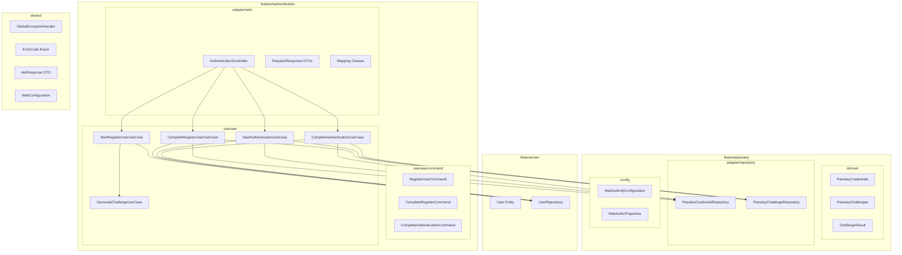
```mermaid
graph TB
    subgraph "feature/authentication"
        subgraph "adapter/web"
            AuthController[AuthenticationController]
            DTOs[Request/Response DTOs]
            Mappings[Mapping Classes]
        end

        subgraph "usecase"
            StartRegister[StartRegisterUserUseCase]
            CompleteRegister[CompleteRegisterUserUseCase]
            StartAuth[StartAuthenticationUseCase]
            CompleteAuth[CompleteAuthenticationUseCase]
        end

        subgraph "usecase/command"
            RegisterCmd[RegisterUserCommand]
            CompleteRegCmd[CompleteRegisterCommand]
            CompleteAuthCmd[CompleteAuthenticationCommand]
        end
    end

    subgraph "feature/passkey"
        subgraph "domain"
            PasskeyCred[PasskeyCredentials]
            PasskeyChallenge[PasskeyChallenges]
            ChallengeResult[ChallengeResult]
        end

        subgraph "adapter/repository"
            CredRepo[PasskeyCredentialRepository]
            ChalRepo[PasskeyChallengeRepository]
        end

        subgraph "config"
            WebAuthnConfig[WebAuthn4jConfiguration]
            WebAuthnProps[WebAuthnProperties]
        end

        subgraph "usecase"
            GenerateChallenge[GenerateChallengeUseCase]
        end
    end

    subgraph "feature/user"
        UserEntity[User Entity]
        UserRepo[UserRepository]
    end

    subgraph "shared"
        GlobalExHandler[GlobalExceptionHandler]
        ErrorCodes[ErrorCode Enum]
        ApiResponse[ApiResponse DTO]
        WebConfig[WebConfiguration]
    end

    AuthController --> StartRegister
    AuthController --> CompleteRegister
    AuthController --> StartAuth
    AuthController --> CompleteAuth

    StartRegister --> GenerateChallenge
    StartRegister --> UserRepo

    CompleteRegister --> ChalRepo
    CompleteRegister --> UserRepo
    CompleteRegister --> CredRepo

    StartAuth --> UserRepo
    StartAuth --> CredRepo
    StartAuth --> ChalRepo

    CompleteAuth --> ChalRepo
    CompleteAuth --> CredRepo
    CompleteAuth --> UserRepo
```

---

## Registration Flow

### Sequence Diagram

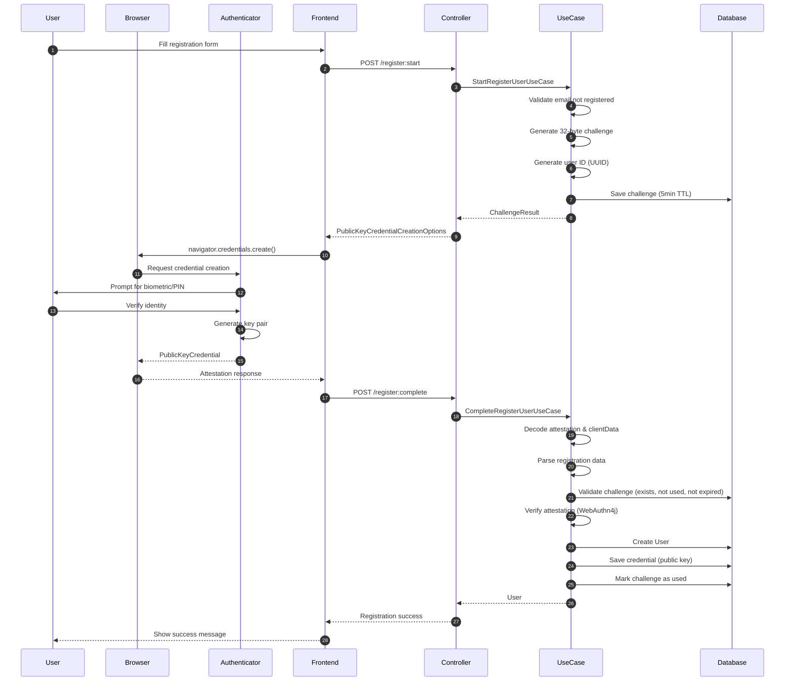
```mermaid
sequenceDiagram
    autonumber
    participant U as User
    participant B as Browser
    participant A as Authenticator
    participant F as Frontend
    participant C as Controller
    participant UC as UseCase
    participant DB as Database

    U->>F: Fill registration form
    F->>C: POST /register:start
    C->>UC: StartRegisterUserUseCase
    UC->>UC: Validate email not registered
    UC->>UC: Generate 32-byte challenge
    UC->>UC: Generate user ID (UUID)
    UC->>DB: Save challenge (5min TTL)
    UC-->>C: ChallengeResult
    C-->>F: PublicKeyCredentialCreationOptions

    F->>B: navigator.credentials.create()
    B->>A: Request credential creation
    A->>U: Prompt for biometric/PIN
    U->>A: Verify identity
    A->>A: Generate key pair
    A-->>B: PublicKeyCredential
    B-->>F: Attestation response

    F->>C: POST /register:complete
    C->>UC: CompleteRegisterUserUseCase
    UC->>UC: Decode attestation & clientData
    UC->>UC: Parse registration data
    UC->>DB: Validate challenge (exists, not used, not expired)
    UC->>UC: Verify attestation (WebAuthn4j)
    UC->>DB: Create User
    UC->>DB: Save credential (public key)
    UC->>DB: Mark challenge as used
    UC-->>C: User
    C-->>F: Registration success
    F-->>U: Show success message
```

### Registration Flow Diagram

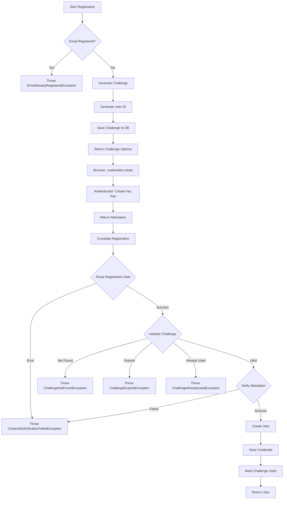
```mermaid
flowchart TD
    A[Start Registration] --> B{Email Registered?}
    B -->|Yes| C[Throw EmailAlreadyRegisteredException]
    B -->|No| D[Generate Challenge]
    D --> E[Generate User ID]
    E --> F[Save Challenge to DB]
    F --> G[Return Challenge Options]
    G --> H[Browser: credentials.create]
    H --> I[Authenticator: Create Key Pair]
    I --> J[Return Attestation]
    J --> K[Complete Registration]
    K --> L{Parse Registration Data}
    L -->|Error| M[Throw CredentialVerificationFailedException]
    L -->|Success| N{Validate Challenge}
    N -->|Not Found| O[Throw ChallengeNotFoundException]
    N -->|Expired| P[Throw ChallengeExpiredException]
    N -->|Already Used| Q[Throw ChallengeAlreadyUsedException]
    N -->|Valid| R{Verify Attestation}
    R -->|Failed| M
    R -->|Success| S[Create User]
    S --> T[Save Credential]
    T --> U[Mark Challenge Used]
    U --> V[Return User]
```

---

## Authentication Flow

### Sequence Diagram

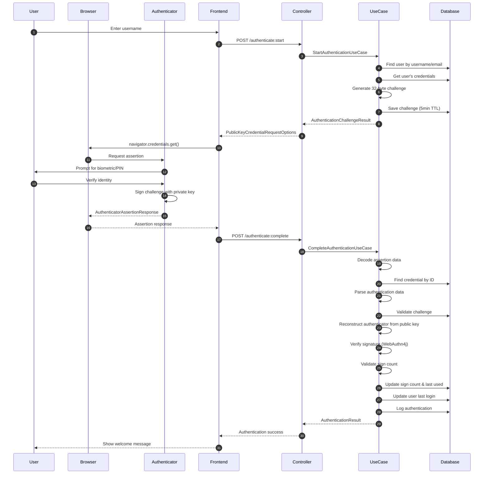
```mermaid
sequenceDiagram
    autonumber
    participant U as User
    participant B as Browser
    participant A as Authenticator
    participant F as Frontend
    participant C as Controller
    participant UC as UseCase
    participant DB as Database

    U->>F: Enter username
    F->>C: POST /authenticate:start
    C->>UC: StartAuthenticationUseCase
    UC->>DB: Find user by username/email
    UC->>DB: Get user's credentials
    UC->>UC: Generate 32-byte challenge
    UC->>DB: Save challenge (5min TTL)
    UC-->>C: AuthenticationChallengeResult
    C-->>F: PublicKeyCredentialRequestOptions

    F->>B: navigator.credentials.get()
    B->>A: Request assertion
    A->>U: Prompt for biometric/PIN
    U->>A: Verify identity
    A->>A: Sign challenge with private key
    A-->>B: AuthenticatorAssertionResponse
    B-->>F: Assertion response

    F->>C: POST /authenticate:complete
    C->>UC: CompleteAuthenticationUseCase
    UC->>UC: Decode assertion data
    UC->>DB: Find credential by ID
    UC->>UC: Parse authentication data
    UC->>DB: Validate challenge
    UC->>UC: Reconstruct authenticator from public key
    UC->>UC: Verify signature (WebAuthn4j)
    UC->>UC: Validate sign count
    UC->>DB: Update sign count & last used
    UC->>DB: Update user last login
    UC->>DB: Log authentication
    UC-->>C: AuthenticationResult
    C-->>F: Authentication success
    F-->>U: Show welcome message
```

### Authentication Flow Diagram

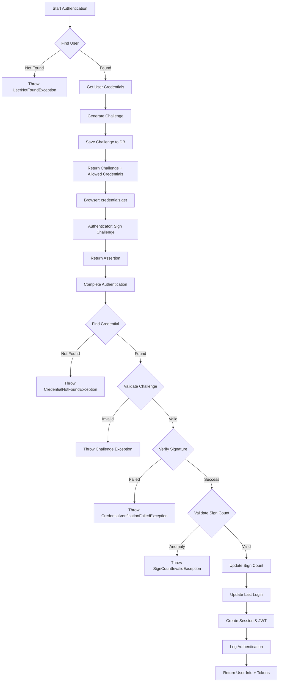
```mermaid
flowchart TD
    A[Start Authentication] --> B{Find User}
    B -->|Not Found| C[Throw UserNotFoundException]
    B -->|Found| D[Get User Credentials]
    D --> E[Generate Challenge]
    E --> F[Save Challenge to DB]
    F --> G[Return Challenge + Allowed Credentials]
    G --> H[Browser: credentials.get]
    H --> I[Authenticator: Sign Challenge]
    I --> J[Return Assertion]
    J --> K[Complete Authentication]
    K --> L{Find Credential}
    L -->|Not Found| M[Throw CredentialNotFoundException]
    L -->|Found| N{Validate Challenge}
    N -->|Invalid| O[Throw Challenge Exception]
    N -->|Valid| P{Verify Signature}
    P -->|Failed| Q[Throw CredentialVerificationFailedException]
    P -->|Success| R{Validate Sign Count}
    R -->|Anomaly| S[Throw SignCountInvalidException]
    R -->|Valid| T[Update Sign Count]
    T --> U[Update Last Login]
    U --> V[Create Session & JWT]
    V --> W[Log Authentication]
    W --> X[Return User Info + Tokens]
```

---

## Account Recovery Flow

### Recovery Options Overview

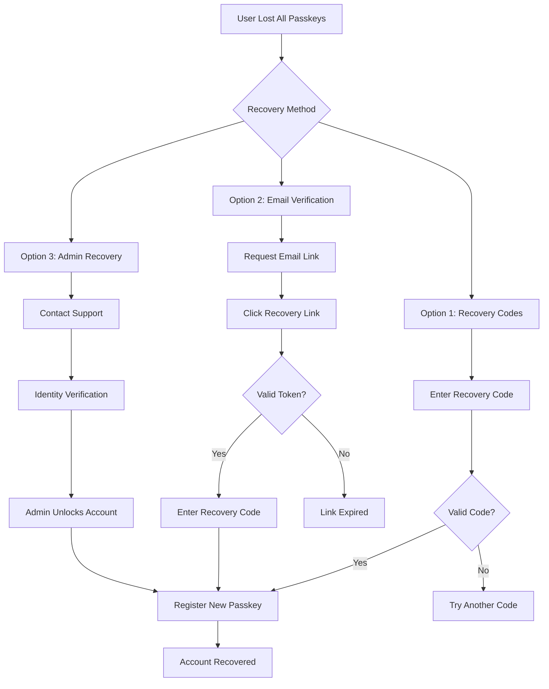
```mermaid
graph TB
    A[User Lost All Passkeys] --> B{Recovery Method}

    B --> C[Option 1: Recovery Codes]
    B --> D[Option 2: Email Verification]
    B --> E[Option 3: Admin Recovery]

    C --> F[Enter Recovery Code]
    F --> G{Valid Code?}
    G -->|Yes| H[Register New Passkey]
    G -->|No| I[Try Another Code]

    D --> J[Request Email Link]
    J --> K[Click Recovery Link]
    K --> L{Valid Token?}
    L -->|Yes| M[Enter Recovery Code]
    M --> H
    L -->|No| N[Link Expired]

    E --> O[Contact Support]
    O --> P[Identity Verification]
    P --> Q[Admin Unlocks Account]
    Q --> H

    H --> R[Account Recovered]
```

### Recovery Code Flow Sequence

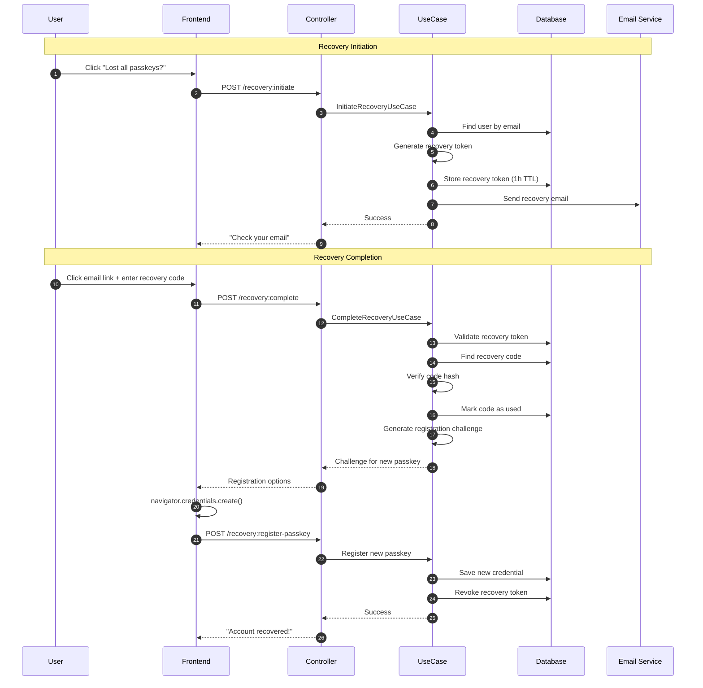
```mermaid
sequenceDiagram
    autonumber
    participant U as User
    participant F as Frontend
    participant C as Controller
    participant UC as UseCase
    participant DB as Database
    participant E as Email Service

    Note over U,E: Recovery Initiation
    U->>F: Click "Lost all passkeys?"
    F->>C: POST /recovery:initiate
    C->>UC: InitiateRecoveryUseCase
    UC->>DB: Find user by email
    UC->>UC: Generate recovery token
    UC->>DB: Store recovery token (1h TTL)
    UC->>E: Send recovery email
    UC-->>C: Success
    C-->>F: "Check your email"

    Note over U,E: Recovery Completion
    U->>F: Click email link + enter recovery code
    F->>C: POST /recovery:complete
    C->>UC: CompleteRecoveryUseCase
    UC->>DB: Validate recovery token
    UC->>DB: Find recovery code
    UC->>UC: Verify code hash
    UC->>DB: Mark code as used
    UC->>UC: Generate registration challenge
    UC-->>C: Challenge for new passkey
    C-->>F: Registration options

    F->>F: navigator.credentials.create()
    F->>C: POST /recovery:register-passkey
    C->>UC: Register new passkey
    UC->>DB: Save new credential
    UC->>DB: Revoke recovery token
    UC-->>C: Success
    C-->>F: "Account recovered!"
```

### Recovery Code Generation

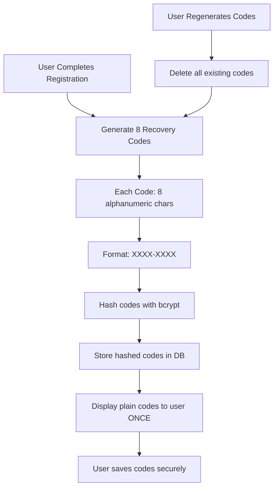
```mermaid
flowchart TD
    A[User Completes Registration] --> B[Generate 8 Recovery Codes]
    B --> C[Each Code: 8 alphanumeric chars]
    C --> D[Format: XXXX-XXXX]
    D --> E[Hash codes with bcrypt]
    E --> F[Store hashed codes in DB]
    F --> G[Display plain codes to user ONCE]
    G --> H[User saves codes securely]

    I[User Regenerates Codes] --> J[Delete all existing codes]
    J --> B
```

---

## Passkey Management Flow

### Add New Passkey Flow

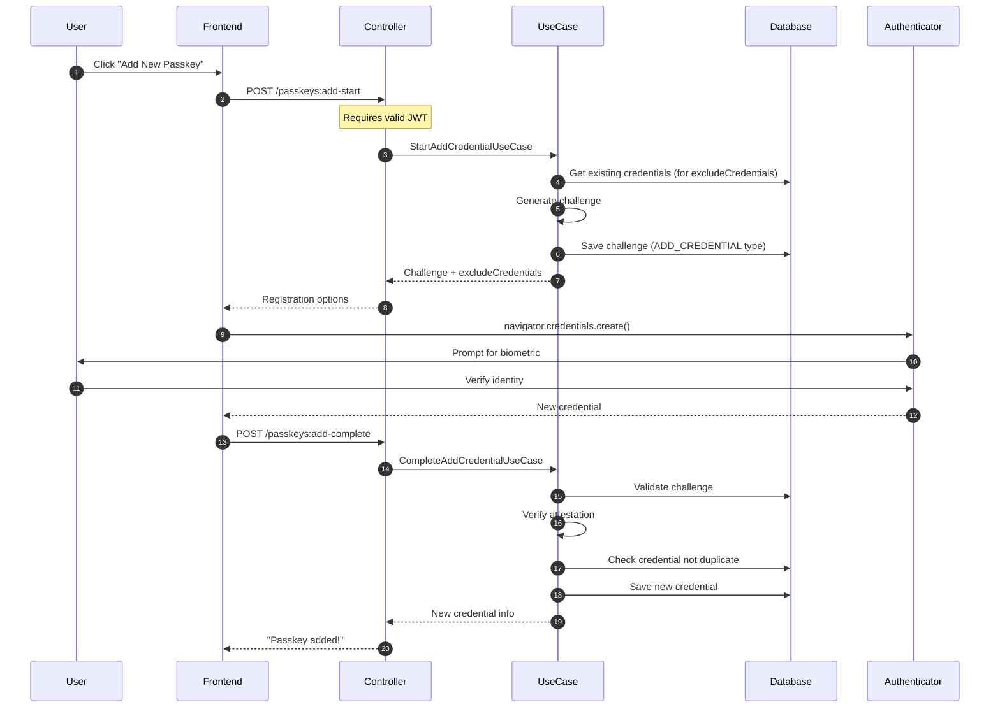
```mermaid
sequenceDiagram
    autonumber
    participant U as User
    participant F as Frontend
    participant C as Controller
    participant UC as UseCase
    participant DB as Database
    participant A as Authenticator

    U->>F: Click "Add New Passkey"
    F->>C: POST /passkeys:add-start
    Note over C: Requires valid JWT
    C->>UC: StartAddCredentialUseCase
    UC->>DB: Get existing credentials (for excludeCredentials)
    UC->>UC: Generate challenge
    UC->>DB: Save challenge (ADD_CREDENTIAL type)
    UC-->>C: Challenge + excludeCredentials
    C-->>F: Registration options

    F->>A: navigator.credentials.create()
    A->>U: Prompt for biometric
    U->>A: Verify identity
    A-->>F: New credential

    F->>C: POST /passkeys:add-complete
    C->>UC: CompleteAddCredentialUseCase
    UC->>DB: Validate challenge
    UC->>UC: Verify attestation
    UC->>DB: Check credential not duplicate
    UC->>DB: Save new credential
    UC-->>C: New credential info
    C-->>F: "Passkey added!"
```

### Passkey Lifecycle

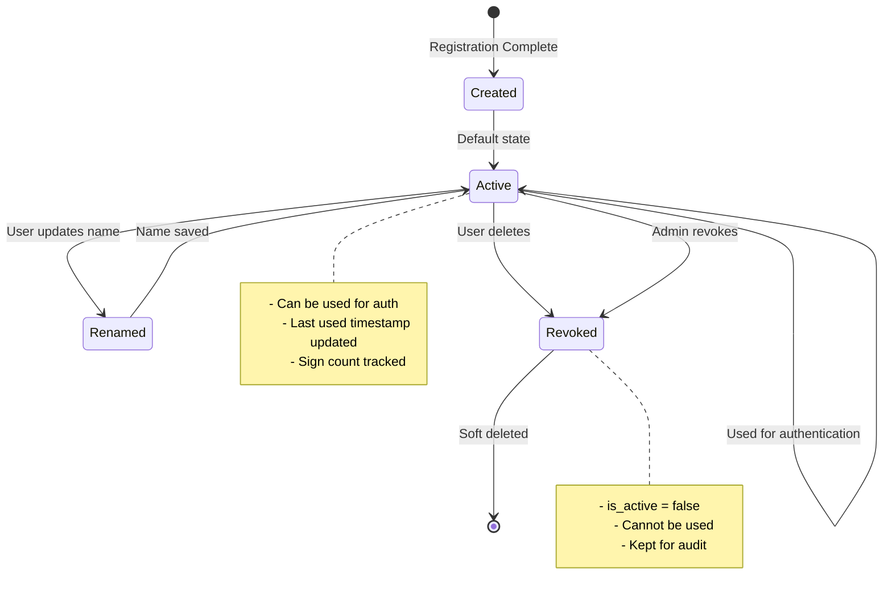
```mermaid
stateDiagram-v2
    [*] --> Created: Registration Complete
    Created --> Active: Default state
    Active --> Active: Used for authentication
    Active --> Renamed: User updates name
    Renamed --> Active: Name saved
    Active --> Revoked: User deletes
    Active --> Revoked: Admin revokes
    Revoked --> [*]: Soft deleted

    note right of Active
        - Can be used for auth
        - Last used timestamp updated
        - Sign count tracked
    end note

    note right of Revoked
        - is_active = false
        - Cannot be used
        - Kept for audit
    end note
```

### Credential Management UI Flow

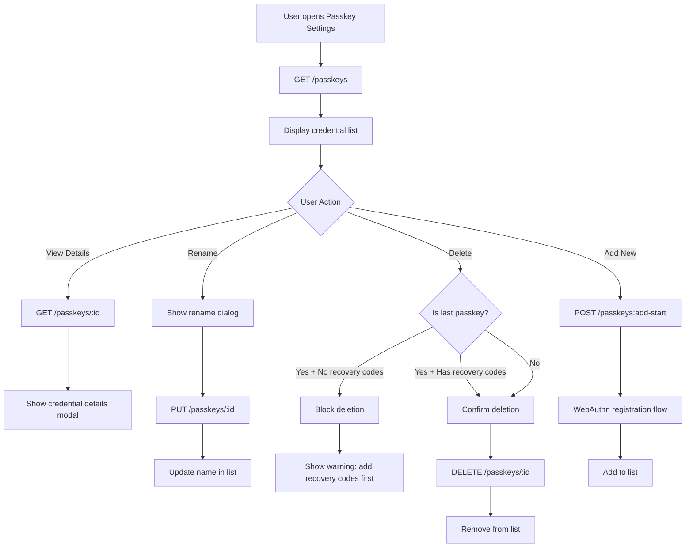
```mermaid
flowchart TD
    A[User opens Passkey Settings] --> B[GET /passkeys]
    B --> C[Display credential list]

    C --> D{User Action}

    D -->|View Details| E[GET /passkeys/:id]
    E --> F[Show credential details modal]

    D -->|Rename| G[Show rename dialog]
    G --> H[PUT /passkeys/:id]
    H --> I[Update name in list]

    D -->|Delete| J{Is last passkey?}
    J -->|Yes + No recovery codes| K[Block deletion]
    K --> L[Show warning: add recovery codes first]
    J -->|Yes + Has recovery codes| M[Confirm deletion]
    J -->|No| M
    M --> N[DELETE /passkeys/:id]
    N --> O[Remove from list]

    D -->|Add New| P[POST /passkeys:add-start]
    P --> Q[WebAuthn registration flow]
    Q --> R[Add to list]
```

---

## Session Management

### Session Lifecycle

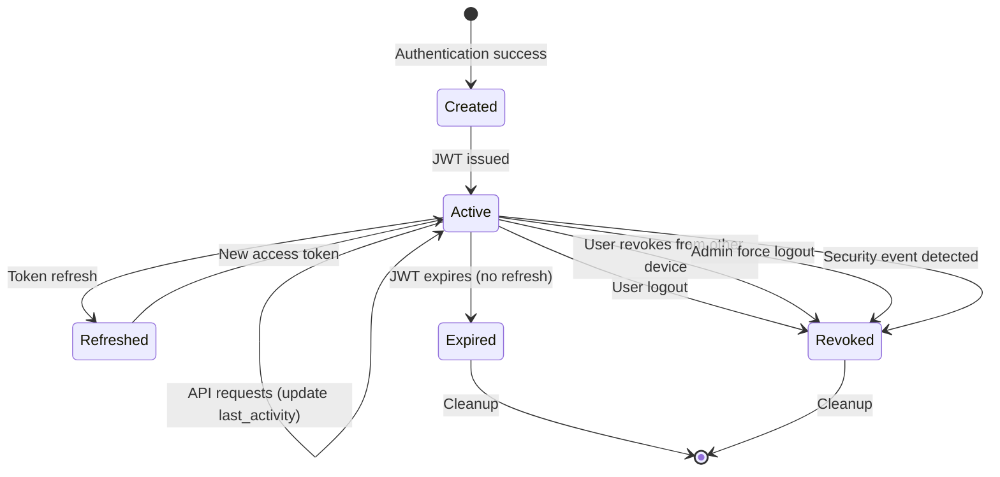
```mermaid
stateDiagram-v2
    [*] --> Created: Authentication success
    Created --> Active: JWT issued

    Active --> Active: API requests (update last_activity)
    Active --> Refreshed: Token refresh
    Refreshed --> Active: New access token

    Active --> Expired: JWT expires (no refresh)
    Active --> Revoked: User logout
    Active --> Revoked: User revokes from other device
    Active --> Revoked: Admin force logout
    Active --> Revoked: Security event detected

    Expired --> [*]: Cleanup
    Revoked --> [*]: Cleanup
```

### JWT Token Flow

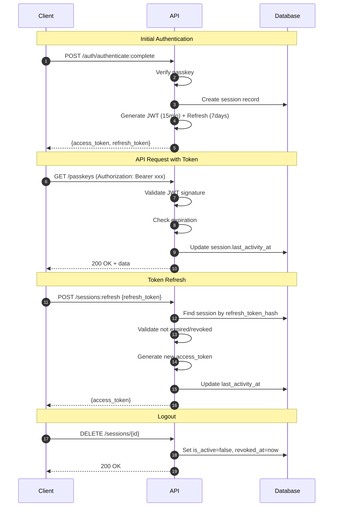
```mermaid
sequenceDiagram
    autonumber
    participant C as Client
    participant A as API
    participant DB as Database

    Note over C,DB: Initial Authentication
    C->>A: POST /auth/authenticate:complete
    A->>A: Verify passkey
    A->>DB: Create session record
    A->>A: Generate JWT (15min) + Refresh (7days)
    A-->>C: {access_token, refresh_token}

    Note over C,DB: API Request with Token
    C->>A: GET /passkeys (Authorization: Bearer xxx)
    A->>A: Validate JWT signature
    A->>A: Check expiration
    A->>DB: Update session.last_activity_at
    A-->>C: 200 OK + data

    Note over C,DB: Token Refresh
    C->>A: POST /sessions:refresh {refresh_token}
    A->>DB: Find session by refresh_token_hash
    A->>A: Validate not expired/revoked
    A->>A: Generate new access_token
    A->>DB: Update last_activity_at
    A-->>C: {access_token}

    Note over C,DB: Logout
    C->>A: DELETE /sessions/{id}
    A->>DB: Set is_active=false, revoked_at=now
    A-->>C: 200 OK
```

### Multi-Session Management

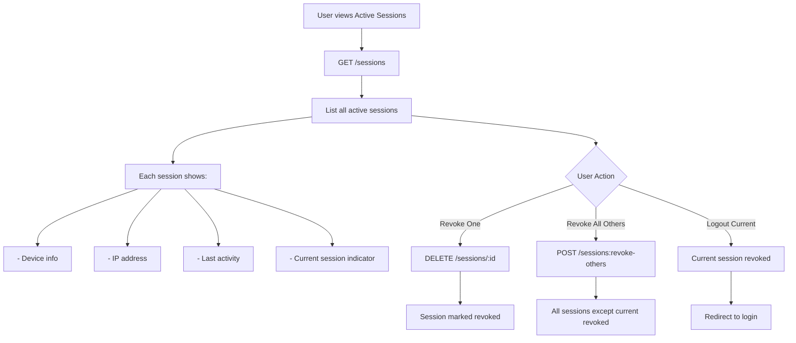
```mermaid
flowchart TD
    A[User views Active Sessions] --> B[GET /sessions]
    B --> C[List all active sessions]

    C --> D[Each session shows:]
    D --> E[- Device info]
    D --> F[- IP address]
    D --> G[- Last activity]
    D --> H[- Current session indicator]

    C --> I{User Action}

    I -->|Revoke One| J[DELETE /sessions/:id]
    J --> K[Session marked revoked]

    I -->|Revoke All Others| L[POST /sessions:revoke-others]
    L --> M[All sessions except current revoked]

    I -->|Logout Current| N[Current session revoked]
    N --> O[Redirect to login]
```

---

## Package Structure

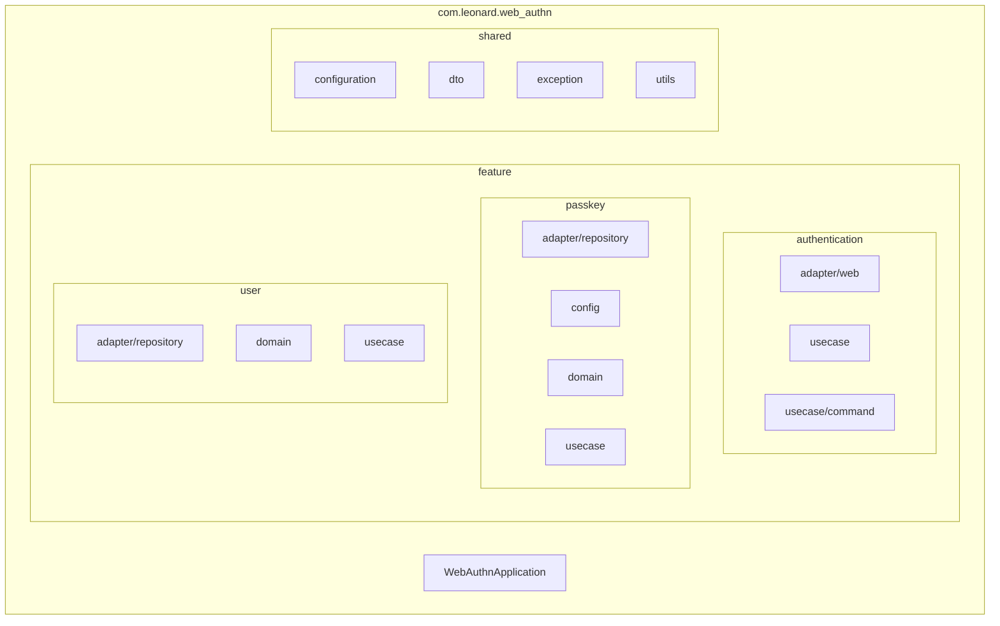
```mermaid
graph TB
    subgraph "com.leonard.web_authn"
        Main[WebAuthnApplication]

        subgraph "feature"
            subgraph "authentication"
                AuthAdapter[adapter/web]
                AuthUseCase[usecase]
                AuthCommand[usecase/command]
            end

            subgraph "passkey"
                PasskeyAdapter[adapter/repository]
                PasskeyConfig[config]
                PasskeyDomain[domain]
                PasskeyUseCase[usecase]
            end

            subgraph "user"
                UserAdapter[adapter/repository]
                UserDomain[domain]
                UserUseCase[usecase]
            end
        end

        subgraph "shared"
            SharedConfig[configuration]
            SharedDTO[dto]
            SharedExc[exception]
            SharedUtils[utils]
        end
    end
```

### Layer Responsibilities

| Layer | Package | Responsibility |
|-------|---------|----------------|
| **Adapter (Web)** | `adapter/web` | HTTP handling, DTOs, mapping |
| **Adapter (Persistence)** | `adapter/repository` | Data access, JPA repositories |
| **Use Case** | `usecase` | Business logic, orchestration |
| **Use Case (Command)** | `usecase/command` | Input validation, command objects |
| **Domain** | `domain` | Entities, value objects, business rules |
| **Configuration** | `config` | Spring beans, properties binding |
| **Shared** | `shared` | Cross-cutting concerns |

---

## Domain Model

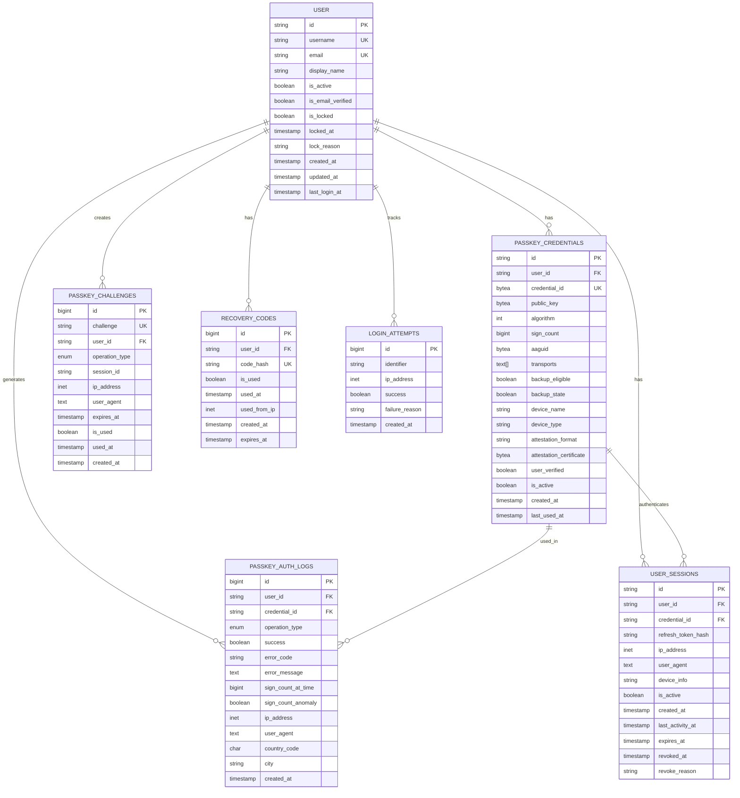
```mermaid
erDiagram
    USER ||--o{ PASSKEY_CREDENTIALS : has
    USER ||--o{ PASSKEY_CHALLENGES : creates
    USER ||--o{ PASSKEY_AUTH_LOGS : generates
    USER ||--o{ RECOVERY_CODES : has
    USER ||--o{ USER_SESSIONS : has
    USER ||--o{ LOGIN_ATTEMPTS : tracks
    PASSKEY_CREDENTIALS ||--o{ PASSKEY_AUTH_LOGS : used_in
    PASSKEY_CREDENTIALS ||--o{ USER_SESSIONS : authenticates

    USER {
        string id PK
        string username UK
        string email UK
        string display_name
        boolean is_active
        boolean is_email_verified
        boolean is_locked
        timestamp locked_at
        string lock_reason
        timestamp created_at
        timestamp updated_at
        timestamp last_login_at
    }

    PASSKEY_CREDENTIALS {
        string id PK
        string user_id FK
        bytea credential_id UK
        bytea public_key
        int algorithm
        bigint sign_count
        bytea aaguid
        text[] transports
        boolean backup_eligible
        boolean backup_state
        string device_name
        string device_type
        string attestation_format
        bytea attestation_certificate
        boolean user_verified
        boolean is_active
        timestamp created_at
        timestamp last_used_at
    }

    PASSKEY_CHALLENGES {
        bigint id PK
        string challenge UK
        string user_id FK
        enum operation_type
        string session_id
        inet ip_address
        text user_agent
        timestamp expires_at
        boolean is_used
        timestamp used_at
        timestamp created_at
    }

    PASSKEY_AUTH_LOGS {
        bigint id PK
        string user_id FK
        string credential_id FK
        enum operation_type
        boolean success
        string error_code
        text error_message
        bigint sign_count_at_time
        boolean sign_count_anomaly
        inet ip_address
        text user_agent
        char country_code
        string city
        timestamp created_at
    }

    RECOVERY_CODES {
        bigint id PK
        string user_id FK
        string code_hash UK
        boolean is_used
        timestamp used_at
        inet used_from_ip
        timestamp created_at
        timestamp expires_at
    }

    USER_SESSIONS {
        string id PK
        string user_id FK
        string credential_id FK
        string refresh_token_hash
        inet ip_address
        text user_agent
        string device_info
        boolean is_active
        timestamp created_at
        timestamp last_activity_at
        timestamp expires_at
        timestamp revoked_at
        string revoke_reason
    }

    LOGIN_ATTEMPTS {
        bigint id PK
        string identifier
        inet ip_address
        boolean success
        string failure_reason
        timestamp created_at
    }
```

---

## Database Schema

### Tables Overview

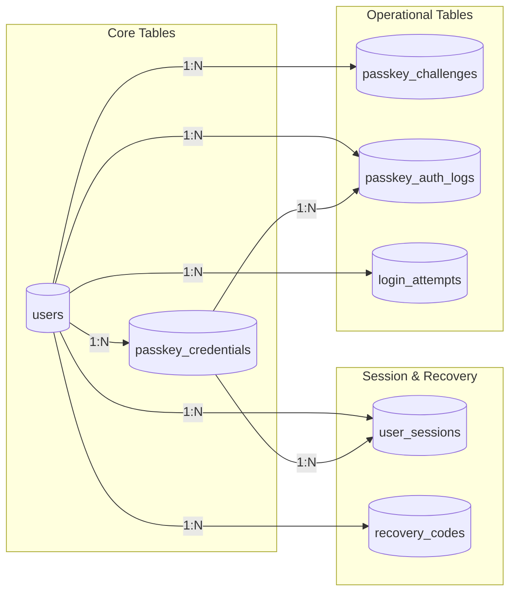
```mermaid
graph LR
    subgraph "Core Tables"
        Users[(users)]
        Credentials[(passkey_credentials)]
    end

    subgraph "Session & Recovery"
        Sessions[(user_sessions)]
        Recovery[(recovery_codes)]
    end

    subgraph "Operational Tables"
        Challenges[(passkey_challenges)]
        Logs[(passkey_auth_logs)]
        Attempts[(login_attempts)]
    end

    Users -->|1:N| Credentials
    Users -->|1:N| Challenges
    Users -->|1:N| Logs
    Users -->|1:N| Sessions
    Users -->|1:N| Recovery
    Users -->|1:N| Attempts
    Credentials -->|1:N| Logs
    Credentials -->|1:N| Sessions
```

### Key Constraints

| Table | Constraint | Purpose |
|-------|-----------|---------|
| `users` | `username` UNIQUE | Prevent duplicate usernames |
| `users` | `email` UNIQUE | Prevent duplicate emails |
| `passkey_credentials` | `credential_id` UNIQUE | WebAuthn credential uniqueness |
| `passkey_credentials` | `algorithm` CHECK | Validate COSE algorithm IDs |
| `passkey_credentials` | `sign_count` >= 0 | Non-negative counter |
| `passkey_challenges` | `challenge` UNIQUE | One-time use enforcement |
| `passkey_challenges` | `expires_at` > `created_at` | Future expiration |

---

## Security Architecture

### Challenge Lifecycle

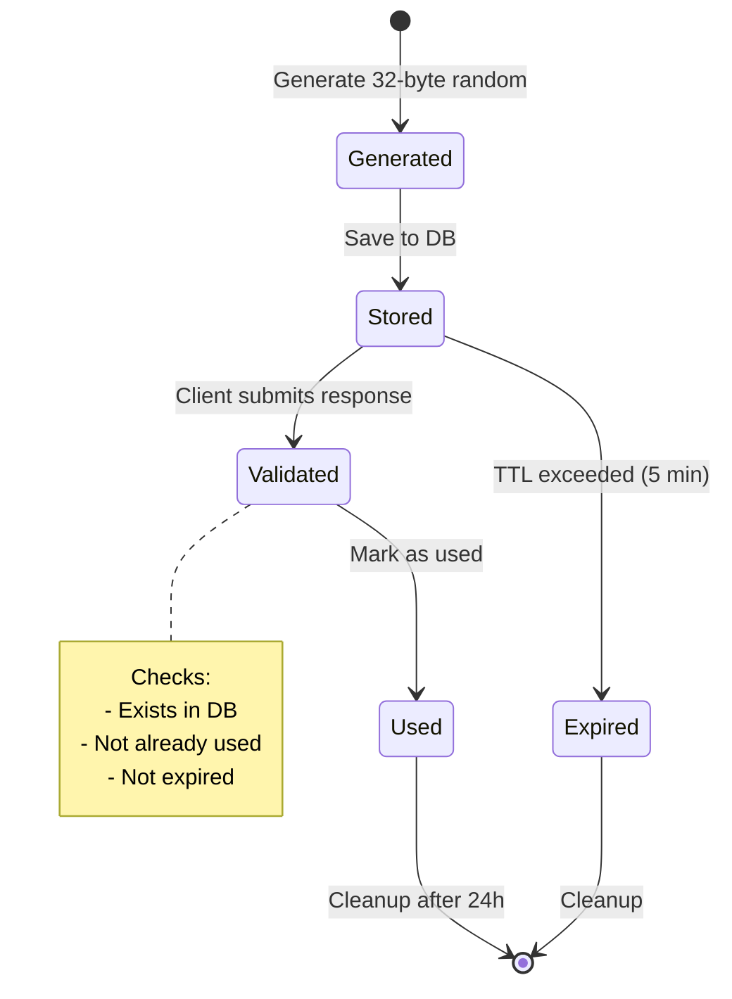
```mermaid
stateDiagram-v2
    [*] --> Generated: Generate 32-byte random
    Generated --> Stored: Save to DB
    Stored --> Validated: Client submits response
    Validated --> Used: Mark as used
    Used --> [*]: Cleanup after 24h

    Stored --> Expired: TTL exceeded (5 min)
    Expired --> [*]: Cleanup

    note right of Validated
        Checks:
        - Exists in DB
        - Not already used
        - Not expired
    end note
```

### Sign Count Validation

```mermaid
flowchart TD
    A[Receive New Sign Count] --> B{Compare with Stored}
    B -->|New > Stored| C[Valid - Update Count]
    B -->|New <= Stored| D{New == 0 AND Stored == 0?}
    D -->|Yes| E[Valid - Authenticator doesn't support]
    D -->|No| F[ANOMALY - Possible Clone!]
    F --> G[Throw SignCountInvalidException]
    F --> H[Log Security Event]
```

### Security Layers

```mermaid
graph TB
    subgraph "Layer 1: Transport"
        HTTPS[HTTPS/TLS]
    end

    subgraph "Layer 2: Origin"
        OriginCheck[Origin Validation]
        CORS[CORS Configuration]
    end

    subgraph "Layer 3: Challenge"
        SecureRandom[SecureRandom Generation]
        OneTimeUse[One-Time Use]
        Expiration[5-minute TTL]
    end

    subgraph "Layer 4: Cryptography"
        PublicKey[Public Key Storage Only]
        Signature[Signature Verification]
        SignCount[Sign Count Validation]
    end

    subgraph "Layer 5: Audit"
        AuthLogs[Authentication Logs]
        AnomalyDetection[Anomaly Detection]
    end

    HTTPS --> OriginCheck
    OriginCheck --> CORS
    CORS --> SecureRandom
    SecureRandom --> OneTimeUse
    OneTimeUse --> Expiration
    Expiration --> PublicKey
    PublicKey --> Signature
    Signature --> SignCount
    SignCount --> AuthLogs
    AuthLogs --> AnomalyDetection
```

### Rate Limiting Architecture

```mermaid
flowchart TD
    A[Incoming Request] --> B[Rate Limiter Interceptor]

    B --> C{Check IP Rate Limit}
    C -->|Exceeded| D[Return 429 Too Many Requests]

    C -->|OK| E{Check User Rate Limit}
    E -->|Exceeded| F[Lock Account]
    F --> G[Return 429 + Lock Notice]

    E -->|OK| H[Process Request]

    H --> I{Request Success?}
    I -->|Yes| J[Reset failure counter]
    I -->|No| K[Increment failure counter]

    K --> L{Threshold Reached?}
    L -->|5 failures/15min| M[Block IP 15min]
    L -->|10 failures/1hr| N[Lock Account]
    L -->|20 failures/1hr| O[Block IP 24hr]
    L -->|Below threshold| P[Continue]

    subgraph "Rate Limit Rules"
        R1[5 failed/15min from IP → 15min block]
        R2[10 failed/1hr for user → Account lock]
        R3[20 failed/1hr from IP → 24hr block]
    end
```

### Account Lock/Unlock Flow

```mermaid
stateDiagram-v2
    [*] --> Active: Account created

    Active --> Locked: Too many failed attempts
    Active --> Locked: User self-lock (security)
    Active --> Locked: Admin lock

    Locked --> Active: Recovery code used
    Locked --> Active: Email verification
    Locked --> Active: Admin unlock

    Active --> Inactive: User deactivates
    Inactive --> Active: User reactivates

    note right of Locked
        Locked accounts cannot:
        - Authenticate
        - Add passkeys
        - Access any protected resources
    end note
```

---

## Error Handling Flow

```mermaid
flowchart TD
    A[Exception Thrown] --> B{Exception Type}

    B -->|BaseException| C[Extract ErrorCode]
    C --> D[Get HTTP Status from ErrorCode]
    D --> E[Build ErrorResponse]

    B -->|ValidationException| F[Extract Field Errors]
    F --> G[Return 400 Bad Request]

    B -->|Unknown Exception| H[Log Full Stack Trace]
    H --> I[Return 500 Internal Error]

    E --> J[Return Response]
    G --> J
    I --> J
```

### Error Codes

| Code | HTTP Status | Description |
|------|-------------|-------------|
| ERR_000001 | 404 | Not Found |
| ERR_000002 | 400 | Invalid Request |
| ERR_000003 | 409 | Email Already Registered |
| ERR_000004 | 404 | Challenge Not Found |
| ERR_000005 | 400 | Challenge Expired |
| ERR_000006 | 400 | Challenge Already Used |
| ERR_000007 | 400 | Credential Verification Failed |
| ERR_000008 | 404 | User Not Found |
| ERR_000009 | 404 | Credential Not Found |
| ERR_000010 | 400 | Sign Count Invalid |
| ERR_000011 | 409 | Username Already Registered |
| ERR_000012 | 409 | Credential Already Registered |
| ERR_000013 | 400 | Challenge Operation Type Mismatch |
| ERR_000014 | 403 | User Account Inactive |
| ERR_000015 | 400 | Credential-User Mismatch |
| ERR_000020 | 429 | Rate Limit Exceeded |
| ERR_000021 | 400 | Cannot Delete Last Passkey |
| ERR_000022 | 400 | Invalid Recovery Code |
| ERR_000023 | 400 | Recovery Code Expired |
| ERR_000024 | 400 | Recovery Code Already Used |
| ERR_000025 | 403 | Account Locked |
| ERR_000026 | 401 | Session Expired |
| ERR_000027 | 401 | Invalid Refresh Token |

---

## Frontend Architecture

```mermaid
graph TB
    subgraph "React App"
        App[App.jsx]

        subgraph "State"
            UserState[User State]
            FormState[Form State]
            MessageState[Message State]
        end

        subgraph "Components"
            RegisterForm[Register Form]
            LoginForm[Login Form]
            UserInfo[User Info Display]
        end
    end

    subgraph "WebAuthn Layer"
        WebAuthnJS[webauthn.js]

        subgraph "API Functions"
            StartReg[startRegistration]
            CompleteReg[completeRegistration]
            StartAuth[startAuthentication]
            CompleteAuth[completeAuthentication]
        end

        subgraph "Helpers"
            B64Encode[bufferToBase64Url]
            B64Decode[base64UrlToBuffer]
        end
    end

    subgraph "Browser APIs"
        CredCreate[navigator.credentials.create]
        CredGet[navigator.credentials.get]
    end

    App --> RegisterForm
    App --> LoginForm
    App --> UserInfo

    RegisterForm --> StartReg
    StartReg --> CompleteReg
    CompleteReg --> CredCreate

    LoginForm --> StartAuth
    StartAuth --> CompleteAuth
    CompleteAuth --> CredGet
```

---

## Deployment Architecture

```mermaid
graph TB
    subgraph "Client"
        Browser[Web Browser]
    end

    subgraph "Frontend Server"
        Vite[Vite Dev Server<br/>:3000]
    end

    subgraph "Backend Server"
        Tomcat[Embedded Tomcat<br/>:8080]
        SpringBoot[Spring Boot App]
    end

    subgraph "Database Server"
        PostgreSQL[(PostgreSQL<br/>:5432)]
    end

    subgraph "Dev Tools"
        pgAdmin[pgAdmin<br/>:18080]
    end

    Browser --> Vite
    Vite -->|/api proxy| Tomcat
    Tomcat --> SpringBoot
    SpringBoot --> PostgreSQL
    pgAdmin --> PostgreSQL
```

---

## Technology Stack Details

```mermaid
mindmap
    root((WebAuthn<br/>System))
        Backend
            Spring Boot 4.0.1
            Java 17
            WebAuthn4j 0.28.5
            Spring Data JPA
            Hibernate 7.2
            Flyway
        Frontend
            React 18.3
            Vite 6.0
            WebAuthn API
        Database
            PostgreSQL 16
            BYTEA for keys
            INET for IPs
        Security
            SecureRandom
            COSE Algorithms
            Sign Count
        DevOps
            Docker Compose
            Maven
            npm
```
