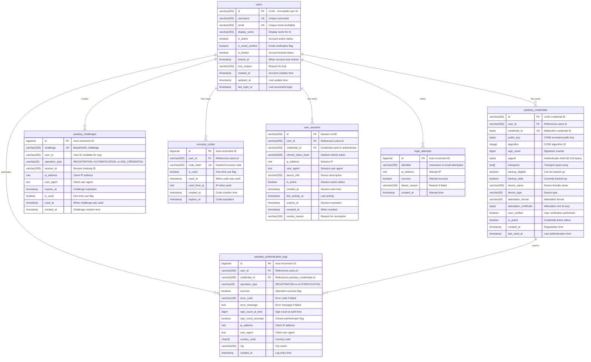

# Database Schema Documentation

## Overview

The database uses PostgreSQL 16 with Flyway for migrations. The schema is designed to support WebAuthn/Passkey authentication with security best practices.

## Entity Relationship Diagram



---

## Tables Detail

### 1. users

Core user account table.

```sql
CREATE TABLE users (
    id VARCHAR(255) PRIMARY KEY,
    username VARCHAR(255) NOT NULL UNIQUE,
    email VARCHAR(255) UNIQUE,
    display_name VARCHAR(255) NOT NULL,
    is_active BOOLEAN NOT NULL DEFAULT true,
    is_email_verified BOOLEAN NOT NULL DEFAULT false,
    is_locked BOOLEAN NOT NULL DEFAULT false,
    locked_at TIMESTAMP,
    lock_reason VARCHAR(100),
    created_at TIMESTAMP NOT NULL DEFAULT CURRENT_TIMESTAMP,
    updated_at TIMESTAMP NOT NULL DEFAULT CURRENT_TIMESTAMP,
    last_login_at TIMESTAMP,

    CONSTRAINT users_username_not_empty CHECK (LENGTH(TRIM(username)) > 0),
    CONSTRAINT users_display_name_not_empty CHECK (LENGTH(TRIM(display_name)) > 0)
);
```

#### Indexes

| Name | Columns | Type | Purpose |
|------|---------|------|---------|
| `idx_users_email` | email | Partial (WHERE NOT NULL) | Email lookup |
| `idx_users_username` | username | B-tree | Username lookup |
| `idx_users_created_at` | created_at | B-tree | Sorting by date |

#### Triggers

- `trigger_users_updated_at` - Auto-updates `updated_at` on row update

---

### 2. passkey_credentials

Stores WebAuthn public keys (CRITICAL SECURITY TABLE).

```sql
CREATE TABLE passkey_credentials (
    id VARCHAR(255) PRIMARY KEY,
    user_id VARCHAR(255) NOT NULL,
    credential_id BYTEA NOT NULL UNIQUE,
    public_key BYTEA NOT NULL,
    algorithm INTEGER NOT NULL,
    sign_count BIGINT NOT NULL DEFAULT 0,
    aaguid BYTEA,
    transports TEXT[],
    backup_eligible BOOLEAN NOT NULL DEFAULT false,
    backup_state BOOLEAN NOT NULL DEFAULT false,
    device_name VARCHAR(255),
    device_type VARCHAR(50),
    attestation_format VARCHAR(50),
    attestation_certificate BYTEA,
    user_verified BOOLEAN NOT NULL DEFAULT false,
    is_active BOOLEAN NOT NULL DEFAULT true,
    created_at TIMESTAMP NOT NULL DEFAULT CURRENT_TIMESTAMP,
    last_used_at TIMESTAMP,

    CONSTRAINT fk_passkey_credentials_user
        FOREIGN KEY (user_id)
        REFERENCES users(id)
        ON DELETE CASCADE,

    CONSTRAINT passkey_credentials_algorithm_valid
        CHECK (algorithm IN (-7, -8, -35, -36, -37, -38, -39, -257, -258, -259)),

    CONSTRAINT passkey_credentials_sign_count_non_negative
        CHECK (sign_count >= 0),

    CONSTRAINT passkey_credentials_aaguid_length
        CHECK (aaguid IS NULL OR LENGTH(aaguid) = 16)
);
```

#### Algorithm Values

| Value | Algorithm | Curve/Hash |
|-------|-----------|------------|
| -7 | ES256 | P-256 + SHA-256 |
| -8 | EdDSA | Ed25519 |
| -35 | ES384 | P-384 + SHA-384 |
| -36 | ES512 | P-521 + SHA-512 |
| -37 | PS256 | RSA-PSS + SHA-256 |
| -38 | PS384 | RSA-PSS + SHA-384 |
| -39 | PS512 | RSA-PSS + SHA-512 |
| -257 | RS256 | RSA-PKCS1 + SHA-256 |
| -258 | RS384 | RSA-PKCS1 + SHA-384 |
| -259 | RS512 | RSA-PKCS1 + SHA-512 |

#### Indexes

| Name | Columns | Purpose |
|------|---------|---------|
| `idx_passkey_credentials_user_id` | user_id | User's credentials lookup |
| `idx_passkey_credentials_credential_id` | credential_id | Credential lookup by ID |
| `idx_passkey_credentials_user_active` | user_id, is_active | Active credentials filter |
| `idx_passkey_credentials_created_at` | created_at | Sorting |
| `idx_passkey_credentials_last_used_at` | last_used_at | Usage tracking |

---

### 3. passkey_challenges

Temporary challenge storage (auto-cleanup required).

```sql
CREATE TABLE passkey_challenges (
    id BIGSERIAL PRIMARY KEY,
    challenge VARCHAR(255) NOT NULL UNIQUE,
    user_id VARCHAR(255),
    operation_type VARCHAR(20) NOT NULL,
    session_id VARCHAR(255),
    ip_address INET,
    user_agent TEXT,
    expires_at TIMESTAMP NOT NULL,
    is_used BOOLEAN NOT NULL DEFAULT false,
    used_at TIMESTAMP,
    created_at TIMESTAMP NOT NULL DEFAULT CURRENT_TIMESTAMP,

    CONSTRAINT passkey_challenges_operation_type_valid
        CHECK (operation_type IN ('REGISTRATION', 'AUTHENTICATION', 'ADD_CREDENTIAL')),

    CONSTRAINT passkey_challenges_expires_at_future
        CHECK (expires_at > created_at)
);
```

#### Indexes

| Name | Columns | Purpose |
|------|---------|---------|
| `idx_passkey_challenges_challenge` | challenge | Challenge lookup |
| `idx_passkey_challenges_user_id` | user_id (partial) | User's challenges |
| `idx_passkey_challenges_expires_at` | expires_at | Expiration cleanup |
| `idx_passkey_challenges_is_used` | is_used | Unused challenges |

---

### 4. passkey_authentication_logs

Audit trail for all authentication attempts.

```sql
CREATE TABLE passkey_authentication_logs (
    id BIGSERIAL PRIMARY KEY,
    user_id VARCHAR(255) NOT NULL,
    credential_id VARCHAR(255),
    operation_type VARCHAR(20) NOT NULL,
    success BOOLEAN NOT NULL,
    error_code VARCHAR(100),
    error_message TEXT,
    sign_count_at_time BIGINT,
    sign_count_anomaly BOOLEAN DEFAULT false,
    ip_address INET,
    user_agent TEXT,
    country_code CHAR(2),
    city VARCHAR(255),
    created_at TIMESTAMP NOT NULL DEFAULT CURRENT_TIMESTAMP,

    CONSTRAINT fk_passkey_auth_logs_user
        FOREIGN KEY (user_id)
        REFERENCES users(id)
        ON DELETE CASCADE,

    CONSTRAINT fk_passkey_auth_logs_credential
        FOREIGN KEY (credential_id)
        REFERENCES passkey_credentials(id)
        ON DELETE SET NULL,

    CONSTRAINT passkey_auth_logs_operation_type_valid
        CHECK (operation_type IN ('REGISTRATION', 'AUTHENTICATION'))
);
```

#### Indexes

| Name | Columns | Purpose |
|------|---------|---------|
| `idx_passkey_auth_logs_user_id` | user_id | User's auth history |
| `idx_passkey_auth_logs_credential_id` | credential_id (partial) | Credential usage |
| `idx_passkey_auth_logs_created_at` | created_at | Time-based queries |
| `idx_passkey_auth_logs_success` | success | Success/failure filter |
| `idx_passkey_auth_logs_anomaly` | sign_count_anomaly (partial) | Security alerts |
| `idx_passkey_auth_logs_ip` | ip_address | IP-based analysis |

---

### 5. recovery_codes

Backup codes for account recovery when all passkeys are lost.

```sql
CREATE TABLE recovery_codes (
    id BIGSERIAL PRIMARY KEY,
    user_id VARCHAR(255) NOT NULL,
    code_hash VARCHAR(255) NOT NULL UNIQUE,
    is_used BOOLEAN NOT NULL DEFAULT false,
    used_at TIMESTAMP,
    used_from_ip INET,
    created_at TIMESTAMP NOT NULL DEFAULT CURRENT_TIMESTAMP,
    expires_at TIMESTAMP,

    CONSTRAINT fk_recovery_codes_user
        FOREIGN KEY (user_id)
        REFERENCES users(id)
        ON DELETE CASCADE
);
```

#### Security Notes

- **Code Format**: 8 codes, each 8 alphanumeric characters (e.g., `ABCD-1234`)
- **Storage**: Codes are hashed with bcrypt before storage
- **One-time use**: Each code can only be used once
- **Regeneration**: User can regenerate all codes (invalidates previous)

#### Indexes

| Name | Columns | Purpose |
|------|---------|---------|
| `idx_recovery_codes_user_id` | user_id | User's codes lookup |
| `idx_recovery_codes_code_hash` | code_hash | Code verification |
| `idx_recovery_codes_user_unused` | user_id, is_used | Find unused codes |

---

### 6. user_sessions

JWT session tracking for authenticated users.

```sql
CREATE TABLE user_sessions (
    id VARCHAR(255) PRIMARY KEY,
    user_id VARCHAR(255) NOT NULL,
    credential_id VARCHAR(255),
    refresh_token_hash VARCHAR(500),
    ip_address INET,
    user_agent TEXT,
    device_info VARCHAR(255),
    is_active BOOLEAN NOT NULL DEFAULT true,
    created_at TIMESTAMP NOT NULL DEFAULT CURRENT_TIMESTAMP,
    last_activity_at TIMESTAMP NOT NULL DEFAULT CURRENT_TIMESTAMP,
    expires_at TIMESTAMP NOT NULL,
    revoked_at TIMESTAMP,
    revoke_reason VARCHAR(100),

    CONSTRAINT fk_user_sessions_user
        FOREIGN KEY (user_id)
        REFERENCES users(id)
        ON DELETE CASCADE,

    CONSTRAINT fk_user_sessions_credential
        FOREIGN KEY (credential_id)
        REFERENCES passkey_credentials(id)
        ON DELETE SET NULL
);
```

#### Session Lifecycle

```
┌─────────┐    ┌─────────┐    ┌─────────┐    ┌─────────┐
│ Created │───▶│ Active  │───▶│ Expired │───▶│ Cleaned │
└─────────┘    └────┬────┘    └─────────┘    └─────────┘
                    │
                    ▼
              ┌─────────┐
              │ Revoked │
              └─────────┘
```

#### Indexes

| Name | Columns | Purpose |
|------|---------|---------|
| `idx_user_sessions_user_id` | user_id | User's sessions |
| `idx_user_sessions_refresh_token` | refresh_token_hash | Token lookup |
| `idx_user_sessions_active` | user_id, is_active | Active sessions |
| `idx_user_sessions_expires` | expires_at | Cleanup job |

---

### 7. login_attempts

Rate limiting and brute force protection tracking.

```sql
CREATE TABLE login_attempts (
    id BIGSERIAL PRIMARY KEY,
    identifier VARCHAR(255) NOT NULL,
    ip_address INET NOT NULL,
    success BOOLEAN NOT NULL DEFAULT false,
    failure_reason VARCHAR(100),
    created_at TIMESTAMP NOT NULL DEFAULT CURRENT_TIMESTAMP
);
```

#### Rate Limiting Rules

| Condition | Action |
|-----------|--------|
| 5 failed attempts in 15 min (same IP) | Block IP for 15 minutes |
| 10 failed attempts in 1 hour (same username) | Lock account, require email verification |
| 20 failed attempts in 1 hour (same IP) | Block IP for 24 hours |

#### Indexes

| Name | Columns | Purpose |
|------|---------|---------|
| `idx_login_attempts_identifier` | identifier | Username/email lookup |
| `idx_login_attempts_ip` | ip_address | IP tracking |
| `idx_login_attempts_created` | created_at | Time-based queries |
| `idx_login_attempts_ip_time` | ip_address, created_at | Rate limiting |

---

## Utility Functions

### cleanup_expired_challenges()

Removes expired or used challenges (run via cron job).

```sql
CREATE OR REPLACE FUNCTION cleanup_expired_challenges()
RETURNS INTEGER AS $$
DECLARE
    deleted_count INTEGER;
BEGIN
    DELETE FROM passkey_challenges
    WHERE expires_at < CURRENT_TIMESTAMP
       OR (is_used = true AND used_at < CURRENT_TIMESTAMP - INTERVAL '1 day');

    GET DIAGNOSTICS deleted_count = ROW_COUNT;
    RETURN deleted_count;
END;
$$ LANGUAGE plpgsql;
```

**Usage:**
```sql
SELECT cleanup_expired_challenges();
```

**Recommended cron:** Every 15 minutes

---

### update_user_last_login()

Trigger function to update `users.last_login_at` on successful authentication.

```sql
CREATE OR REPLACE FUNCTION update_user_last_login()
RETURNS TRIGGER AS $$
BEGIN
    IF NEW.success = true AND NEW.operation_type = 'AUTHENTICATION' THEN
        UPDATE users
        SET last_login_at = NEW.created_at
        WHERE id = NEW.user_id;
    END IF;
    RETURN NEW;
END;
$$ LANGUAGE plpgsql;

CREATE TRIGGER trigger_update_user_last_login
    AFTER INSERT ON passkey_authentication_logs
    FOR EACH ROW
    EXECUTE FUNCTION update_user_last_login();
```

---

### update_updated_at_column()

Generic trigger for auto-updating `updated_at` columns.

```sql
CREATE OR REPLACE FUNCTION update_updated_at_column()
RETURNS TRIGGER AS $$
BEGIN
    NEW.updated_at = CURRENT_TIMESTAMP;
    RETURN NEW;
END;
$$ LANGUAGE plpgsql;

CREATE TRIGGER trigger_users_updated_at
    BEFORE UPDATE ON users
    FOR EACH ROW
    EXECUTE FUNCTION update_updated_at_column();
```

---

### cleanup_expired_sessions()

Removes expired sessions (run via cron job).

```sql
CREATE OR REPLACE FUNCTION cleanup_expired_sessions()
RETURNS INTEGER AS $$
DECLARE
    deleted_count INTEGER;
BEGIN
    DELETE FROM user_sessions
    WHERE expires_at < CURRENT_TIMESTAMP
       OR (revoked_at IS NOT NULL AND revoked_at < CURRENT_TIMESTAMP - INTERVAL '7 days');

    GET DIAGNOSTICS deleted_count = ROW_COUNT;
    RETURN deleted_count;
END;
$$ LANGUAGE plpgsql;
```

**Recommended cron:** Every hour

---

### cleanup_old_login_attempts()

Removes old login attempt records (run via cron job).

```sql
CREATE OR REPLACE FUNCTION cleanup_old_login_attempts()
RETURNS INTEGER AS $$
DECLARE
    deleted_count INTEGER;
BEGIN
    DELETE FROM login_attempts
    WHERE created_at < CURRENT_TIMESTAMP - INTERVAL '7 days';

    GET DIAGNOSTICS deleted_count = ROW_COUNT;
    RETURN deleted_count;
END;
$$ LANGUAGE plpgsql;
```

**Recommended cron:** Daily

---

### check_rate_limit()

Check if IP or identifier is rate limited.

```sql
CREATE OR REPLACE FUNCTION check_rate_limit(
    p_identifier VARCHAR(255),
    p_ip_address INET
)
RETURNS TABLE (
    is_blocked BOOLEAN,
    block_reason VARCHAR(100),
    retry_after_seconds INTEGER
) AS $$
DECLARE
    ip_failures_15min INTEGER;
    identifier_failures_1h INTEGER;
    ip_failures_1h INTEGER;
BEGIN
    -- Count failures in last 15 minutes for this IP
    SELECT COUNT(*) INTO ip_failures_15min
    FROM login_attempts
    WHERE ip_address = p_ip_address
      AND success = false
      AND created_at > CURRENT_TIMESTAMP - INTERVAL '15 minutes';

    -- Count failures in last hour for this identifier
    SELECT COUNT(*) INTO identifier_failures_1h
    FROM login_attempts
    WHERE identifier = p_identifier
      AND success = false
      AND created_at > CURRENT_TIMESTAMP - INTERVAL '1 hour';

    -- Count failures in last hour for this IP
    SELECT COUNT(*) INTO ip_failures_1h
    FROM login_attempts
    WHERE ip_address = p_ip_address
      AND success = false
      AND created_at > CURRENT_TIMESTAMP - INTERVAL '1 hour';

    -- Check rate limits
    IF ip_failures_1h >= 20 THEN
        RETURN QUERY SELECT true, 'IP blocked for 24 hours'::VARCHAR(100), 86400;
    ELSIF identifier_failures_1h >= 10 THEN
        RETURN QUERY SELECT true, 'Account locked - too many failed attempts'::VARCHAR(100), 3600;
    ELSIF ip_failures_15min >= 5 THEN
        RETURN QUERY SELECT true, 'Too many attempts - try again later'::VARCHAR(100), 900;
    ELSE
        RETURN QUERY SELECT false, NULL::VARCHAR(100), 0;
    END IF;
END;
$$ LANGUAGE plpgsql;
```

**Usage:**
```sql
SELECT * FROM check_rate_limit('john_doe', '192.168.1.1');
```

---

## Migration History

| Version | File | Description |
|---------|------|-------------|
| V1 | `V1__create_webauthn_tables.sql` | Initial schema |
| V2 | `V2__fix_operation_type_constraints.sql` | Fix enum case, credential ID type |
| V3 | `V3__add_recovery_and_session_tables.sql` | Add recovery codes, sessions, rate limiting |

---

## Data Types Reference

### PostgreSQL-specific Types

| Type | Column | Purpose |
|------|--------|---------|
| `BYTEA` | credential_id, public_key, aaguid | Binary data storage |
| `TEXT[]` | transports | Array of transport strings |
| `INET` | ip_address | IPv4/IPv6 address storage |
| `BIGSERIAL` | id (challenges, logs) | Auto-increment 64-bit |

### Transport Values

Valid values for `transports` array:

| Value | Description |
|-------|-------------|
| `usb` | USB transport |
| `nfc` | NFC transport |
| `ble` | Bluetooth Low Energy |
| `internal` | Platform authenticator |
| `hybrid` | Cross-device (QR code) |

---

## Query Examples

### Get user's active credentials

```sql
SELECT
    id,
    credential_id,
    algorithm,
    sign_count,
    device_name,
    created_at,
    last_used_at
FROM passkey_credentials
WHERE user_id = 'user-uuid'
  AND is_active = true
ORDER BY last_used_at DESC NULLS LAST;
```

### Find authentication anomalies

```sql
SELECT
    l.created_at,
    u.username,
    l.ip_address,
    l.sign_count_at_time,
    l.error_message
FROM passkey_authentication_logs l
JOIN users u ON l.user_id = u.id
WHERE l.sign_count_anomaly = true
ORDER BY l.created_at DESC
LIMIT 100;
```

### Get authentication statistics

```sql
SELECT
    DATE_TRUNC('day', created_at) AS date,
    operation_type,
    COUNT(*) AS total,
    SUM(CASE WHEN success THEN 1 ELSE 0 END) AS successful,
    SUM(CASE WHEN NOT success THEN 1 ELSE 0 END) AS failed
FROM passkey_authentication_logs
WHERE created_at > CURRENT_DATE - INTERVAL '30 days'
GROUP BY DATE_TRUNC('day', created_at), operation_type
ORDER BY date DESC;
```

### Cleanup old challenges (manual)

```sql
DELETE FROM passkey_challenges
WHERE expires_at < CURRENT_TIMESTAMP - INTERVAL '1 hour';
```

### Get user's unused recovery codes count

```sql
SELECT COUNT(*)
FROM recovery_codes
WHERE user_id = 'user-uuid'
  AND is_used = false
  AND (expires_at IS NULL OR expires_at > CURRENT_TIMESTAMP);
```

### Get user's active sessions

```sql
SELECT
    id,
    ip_address,
    user_agent,
    device_info,
    created_at,
    last_activity_at
FROM user_sessions
WHERE user_id = 'user-uuid'
  AND is_active = true
  AND expires_at > CURRENT_TIMESTAMP
ORDER BY last_activity_at DESC;
```

### Check failed login attempts for IP

```sql
SELECT
    identifier,
    COUNT(*) as attempt_count,
    MAX(created_at) as last_attempt
FROM login_attempts
WHERE ip_address = '192.168.1.1'
  AND success = false
  AND created_at > CURRENT_TIMESTAMP - INTERVAL '1 hour'
GROUP BY identifier
ORDER BY attempt_count DESC;
```

### Revoke all user sessions

```sql
UPDATE user_sessions
SET is_active = false,
    revoked_at = CURRENT_TIMESTAMP,
    revoke_reason = 'User initiated logout all'
WHERE user_id = 'user-uuid'
  AND is_active = true;
```

---

## Backup Considerations

### Critical Tables (must backup)

1. `users` - User account data
2. `passkey_credentials` - Public keys (users cannot re-register without credential loss)

### Operational Tables (optional backup)

1. `passkey_challenges` - Temporary data, can be regenerated
2. `passkey_authentication_logs` - Audit logs, backup for compliance

### Backup Command

```bash
pg_dump -h localhost -U web-authn -d web-authn \
    -t users -t passkey_credentials \
    -F c -f backup.dump
```

---

## Performance Tuning

### Recommended PostgreSQL Settings

```ini
# For WebAuthn workloads
shared_buffers = 256MB
effective_cache_size = 768MB
maintenance_work_mem = 64MB
work_mem = 16MB

# Connection pooling
max_connections = 100

# Logging for security
log_statement = 'mod'
log_connections = on
log_disconnections = on
```

### Index Maintenance

```sql
-- Reindex after bulk operations
REINDEX TABLE passkey_credentials;
REINDEX TABLE passkey_authentication_logs;

-- Analyze for query planner
ANALYZE passkey_credentials;
ANALYZE passkey_authentication_logs;
```
